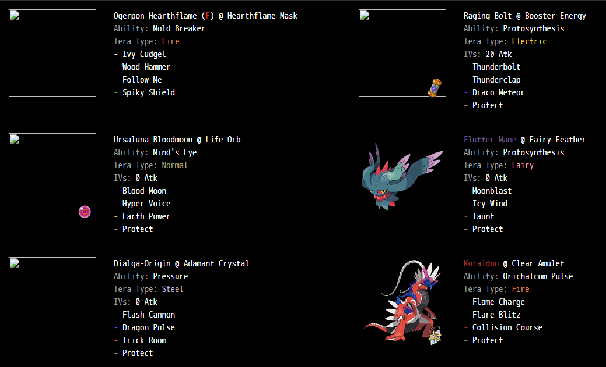
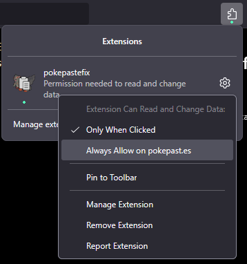

# pokepastefix

The premiere pokemon team sharing tool, <a href="https://pokepast.es" target="_blank" rel="noopener noreferrer">pokepast.es</a> is missing images for some of the newest pokemon. This web extension replaces them using dynamic inline resource insertion. Images supplied by the [hqmons](https://github.com/afnleaf/hqmons) server [chiy.uk](https://chiy.uk)

## Install

 

make sure to enable permissions on Firefox.

## Features
- [x] unify codebase for Blink and Gecko
- [ ] name colors
- [ ] group thinking, system design refactor
- [ ] shiny, april fools, CAP art

